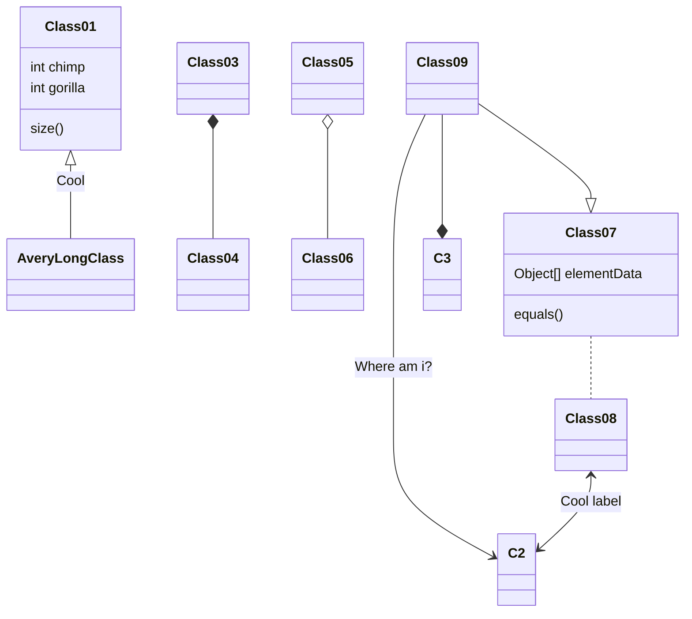

博客从 Docusaurus 迁移到 Hugo。

博客最开始使用 Hexo，但由于主题逐渐年久失修，准备换一个博客框架，最好能方便自定义，由于想统一技术栈和眼馋 [MDX](https://mdxjs.com/) 的导入导出，首先选择了 Docusaurus，迁移之后没多久，弊端逐渐开始出现了，构建页面居然要跑 60+ 秒，还有那巨大的 node_modules 越看越不顺眼，干脆放弃使用 node 了。于是选择了 Hugo，经过编译的程序确实快，自定义也方便，但缺点是模板语法有点丑陋。

<!--more-->

## Markdown 扩展

### 标题锚点 {#title-anchor}

可在标题后增加花括号指定标题 id。

### 脚注

脚注使你可以添加注释和参考[^1]
[^1]: [官方文档](https://fixit.lruihao.cn/zh-cn/documentation/content-management/markdown-syntax/basics/#%e8%84%9a%e6%b3%a8)

### 代码块

可使用以下属性：

- `title`: 标题
- `hl_lines`: 高亮行
- `linenostart`: 开始行号
- `.no-header`: 无头样式
- `.data-open`: 强制展开或折叠代码块

```ts {title="test.ts",hl_lines=[2,"4-6"],linenostart=99,.no-header,data-open=true}
function sort1(a: number, b: number):boolean {
  return a < b
}
function sort2(a: number, b: number):boolean {
  return a > b
}
```

#### JsonViewer

```json
{
  "name": "FixIt",
  "version": "0.4.0",
  "description": "一个简洁、优雅且高效的 Hugo 博客主题",
  "keywords": ["Hugo", "主题", "FixIt"]
}
```

#### FileTree


[[filetree]]
name = "src"
type = "dir"

[[filetree.children]]
name = "index.ts"
type = "file"

[[filetree.children]]
name = "app.ts"
type = "file"

[[filetree]]
name = "package.json"
type = "file"


#### Mermaid



#### GoAT

```goat
   .---.       .-.        .-.       .-.                                       .-.
   | A +----->| 1 +<---->| 2 |<----+ 4 +------------------.                  | 8 |
   '---'       '-'        '+'       '-'                    |                  '-'
                           |         ^                     |                   ^
                           v         |                     v                   |
                          .-.      .-+-.        .-.      .-+-.      .-.       .+.       .---.
                         | 3 +---->| B |<----->| 5 +---->| C +---->| 6 +---->| 7 |<---->| D |
                          '-'      '---'        '-'      '---'      '-'       '-'       '---'
```

#### ECharts

```echarts {width="100%", height="30rem"}
title:
  text: 折线统计图
  top: 2%
  left: center
tooltip:
  trigger: axis
legend:
  data:
    - 邮件营销
    - 联盟广告
    - 视频广告
    - 直接访问
    - 搜索引擎
  top: 10%
grid:
  left: 5%
  right: 5%
  bottom: 5%
  top: 20%
  containLabel: true
toolbox:
  feature:
    saveAsImage:
      title: 保存为图片
xAxis:
  type: category
  boundaryGap: false
  data:
    - 周一
    - 周二
    - 周三
    - 周四
    - 周五
    - 周六
    - 周日
yAxis:
  type: value
series:
  - name: 邮件营销
    type: line
    stack: 总量
    data:
      - 120
      - 132
      - 101
      - 134
      - 90
      - 230
      - 210
  - name: 联盟广告
    type: line
    stack: 总量
    data:
      - 220
      - 182
      - 191
      - 234
      - 290
      - 330
      - 310
  - name: 视频广告
    type: line
    stack: 总量
    data:
      - 150
      - 232
      - 201
      - 154
      - 190
      - 330
      - 410
  - name: 直接访问
    type: line
    stack: 总量
    data:
      - 320
      - 332
      - 301
      - 334
      - 390
      - 330
      - 320
  - name: 搜索引擎
    type: line
    stack: 总量
    data:
      - 820
      - 932
      - 901
      - 934
      - 1290
      - 1330
      - 1320
```

#### 时间线

```timeline
events:
  - timestamp: 2024-07-19 20:30
    content: 支持自定义风格
    type: primary
    node: dot
  - timestamp: 2024-07-19 20:30
    content: 支持自定义颜色
    color: "#0CBD87"
    node: dot
  - timestamp: 2024-07-19 20:30
    content: 支持自定义尺寸
    size: large
  - timestamp: 2024-07-20 20:30
    content: 默认样式的节点
```

### 警示

> [!NOTE]
> 突出显示用户应考虑的信息，与 GitHub、Obsidian 和 Typora 兼容。

> [!TIP]
> 类型可选：
> - `NOTE`: 笔记
> - `TIP`: 提示
> - `IMPORTANT`: 重要
> - `WARNING`: 警告
> - `CAUTION`: 错误

> [!IMPORTANT]
> 用户成功所需的关键信息。

> [!WARNING]
> 由于存在潜在风险，需要用户立即关注的关键内容。

> [!CAUTION]
> 操作的潜在负面后果。

#### 扩展

> [!NOTE] 笔记
> 增加标题形成 Admonition 警示块。

> [!TIP]- 可以折叠
> 可在 `[]` 后方增加 `+` \\ `-` 控制警示块折叠。

> [!EXAMPLE]+ 多种样式
> | 关键字    | 样式 |
> | --------- | ---- |
> | NOTE      | 笔记 |
> | TIP       | 提示 |
> | EXAMPLE   | 样例 |
> | ABSTRACT  | 摘要 |
> | TODO      | 待办 |
> | SUCCESS   | 成功 |
> | IMPORTANT | 重要 |
> | QUESTION  | 问题 |
> | WARNING   | 警告 |
> | BUG       | BUG  |
> | ERROR     | 错误 |
> | FAILURE   | 失败 |
> | QUOTE     | 引用 |


> [!ABSTRACT] 摘要

> [!TODO] 待办

> [!SUCCESS] 成功

> [!IMPORTANT] 重要

> [!QUESTION] 问题

> [!WARNING] 警告

> [!BUG] BUG

> [!ERROR] 错误

> [!FAILURE] 失败

> [!QUOTE] 引用

### 待办

- [ ] 未完成
- [x] 已完成
- [/] 进行中
- [-] 已取消
- [<] 已计划
- [>] 已重新计划
- [!] 重要
- [?] 问题

### 文字样式

- ++下划线++

- ==标记==
- ==Primary==[primary]
- ==Secondary==[secondary]
- ==Success==[success]
- ==Info==[info]
- ==Warning==[warning]
- ==Danger==[danger]

- 下标：H~2~O
- 上标：2^10^ = 1024

- emoji： :smiley_cat: [官方文档](https://fixit.lruihao.cn/zh-cn/guides/emoji-support/)


### LaTeX

行内公式：$E=mc^2$

块公式：

$$e^{i\theta} = \cos(\theta) + i\sin(\theta)$$

### 注音

[佐天泪子]^(掀裙狂魔)

### 分数

[亮色]/[暗色]

[90]/[100]

### FontIcon

:(fa-regular fa-heart):
:(fa-regular fa-circle-user):

图标在此处搜索：[fontawesome](https://fontawesome.com/icons/)

## Shortcode

### 图表



### 二维码



### 音乐



### 打字机


这一个带有基于 [TypeIt](https://typeitjs.com/) 的 **打字动画** 的 *段落*……

