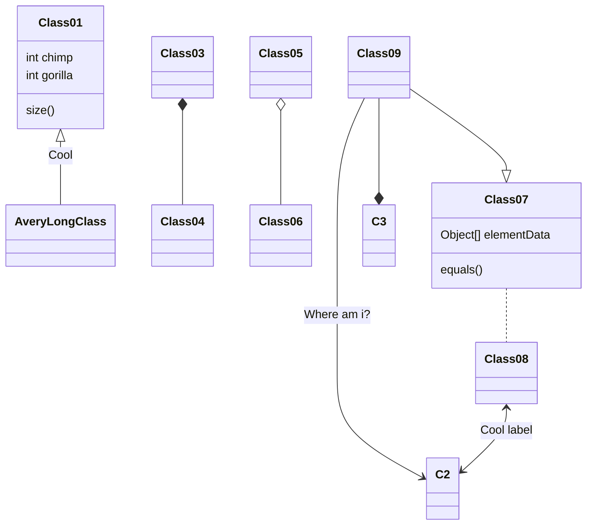

博客从 Docusaurus 迁移到 Hugo。

博客最开始使用 Hexo，但由于主题逐渐年久失修，准备换一个博客框架，最好能方便自定义，由于想统一技术栈和眼馋 [MDX](https://mdxjs.com/) 的导入导出，首先选择了 Docusaurus，迁移之后没多久，弊端逐渐开始出现了，构建页面居然要跑 60+ 秒，还有那巨大的 node_modules 越看越不顺眼，干脆放弃使用 node 了。于是选择了 Hugo，经过编译的程序确实快，自定义也方便，但缺点是模板语法有点丑陋。

<!--more-->

## Markdown 扩展

### 标题锚点 {#title-anchor}

可在标题后增加花括号指定标题 id。

### 脚注

脚注使你可以添加注释和参考[^1]
[^1]: [官方文档](https://fixit.lruihao.cn/zh-cn/documentation/content-management/markdown-syntax/basics/#%e8%84%9a%e6%b3%a8)

### 代码块

可使用以下属性：

- `title`: 标题
- `hl_lines`: 高亮行
- `linenostart`: 开始行号
- `.no-header`: 无头样式
- `.data-open`: 强制展开或折叠代码块

```ts {title="test.ts",hl_lines=[2,"4-6"],linenostart=99,.no-header,data-open=true}
function sort1(a: number, b: number):boolean {
  return a < b
}
function sort2(a: number, b: number):boolean {
  return a > b
}
```

> [!NOTE]- 代码块支持语言
> | Language                    | Identifiers                                 |
> |-----------------------------|---------------------------------------------|
> | ABAP                        | abap                                        |
> | ABNF                        | abnf                                        |
> | ActionScript                | as, actionscript                            |
> | ActionScript 3              | as3, actionscript3                          |
> | Ada                         | ada, ada95, ada2005                         |
> | Agda                        | agda                                        |
> | AL                          | al                                          |
> | Alloy                       | alloy                                       |
> | Angular2                    | ng2                                         |
> | ANTLR                       | antlr                                       |
> | ApacheConf                  | apacheconf, aconf, apache                   |
> | APL                         | apl                                         |
> | AppleScript                 | applescript                                 |
> | ArangoDB AQL                | aql                                         |
> | Arduino                     | arduino                                     |
> | ArmAsm                      | armasm                                      |
> | ATL                         | atl                                         |
> | AutoHotkey                  | autohotkey, ahk                             |
> | AutoIt                      | autoit                                      |
> | Awk                         | awk, gawk, mawk, nawk                       |
> | Ballerina                   | ballerina                                   |
> | Bash                        | bash, sh, ksh, zsh, shell                   |
> | Bash Session                | bash-session, console, shell-session        |
> | Batchfile                   | bat, batch, dosbatch, winbatch              |
> | Beef                        | beef                                        |
> | BibTeX                      | bib, bibtex                                 |
> | Bicep                       | bicep                                       |
> | BlitzBasic                  | blitzbasic, b3d, bplus                      |
> | BNF                         | bnf                                         |
> | BQN                         | bqn                                         |
> | Brainfuck                   | brainfuck, bf                               |
> | C                           | c                                           |
> | C#                          | csharp, c#                                  |
> | C++                         | cpp, c++                                    |
> | Caddyfile                   | caddyfile, caddy                            |
> | Caddyfile Directives        | caddyfile-directives, caddyfile-d, caddy-d  |
> | Cap'n Proto                 | capnp                                       |
> | Cassandra CQL               | cassandra, cql                              |
> | Ceylon                      | ceylon                                      |
> | CFEngine3                   | cfengine3, cf3                              |
> | cfstatement                 | cfs                                         |
> | ChaiScript                  | chai, chaiscript                            |
> | Chapel                      | chapel, chpl                                |
> | Cheetah                     | cheetah, spitfire                           |
> | Clojure                     | clojure, clj, edn                           |
> | CMake                       | cmake                                       |
> | COBOL                       | cobol                                       |
> | CoffeeScript                | coffee-script, coffeescript, coffee         |
> | Common Lisp                 | common-lisp, cl, lisp                       |
> | Coq                         | coq                                         |
> | Core                        | core                                        |
> | Crystal                     | cr, crystal                                 |
> | CSS                         | css                                         |
> | CSV                         | csv                                         |
> | CUE                         | cue                                         |
> | Cython                      | cython, pyx, pyrex                          |
> | D                           | d                                           |
> | Dart                        | dart                                        |
> | Dax                         | dax                                         |
> | Desktop file                | desktop, desktop_entry                      |
> | Diff                        | diff, udiff                                 |
> | Django/Jinja                | django, jinja                               |
> | dns                         | zone, bind                                  |
> | Docker                      | docker, dockerfile                          |
> | DTD                         | dtd                                         |
> | Dylan                       | dylan                                       |
> | EBNF                        | ebnf                                        |
> | Elixir                      | elixir, ex, exs                             |
> | Elm                         | elm                                         |
> | EmacsLisp                   | emacs, elisp, emacs-lisp                    |
> | Erlang                      | erlang                                      |
> | Factor                      | factor                                      |
> | Fennel                      | fennel, fnl                                 |
> | Fish                        | fish, fishshell                             |
> | Forth                       | forth                                       |
> | Fortran                     | fortran, f90                                |
> | FortranFixed                | fortranfixed                                |
> | FSharp                      | fsharp                                      |
> | GAS                         | gas, asm                                    |
> | GDScript                    | gdscript, gd                                |
> | GDScript3                   | gdscript3, gd3                              |
> | Genshi                      | genshi, kid, xml+genshi, xml+kid            |
> | Genshi HTML                 | html+genshi, html+kid                       |
> | Genshi Text                 | genshitext                                  |
> | Gherkin                     | cucumber, Cucumber, gherkin, Gherkin        |
> | Gleam                       | gleam                                       |
> | GLSL                        | glsl                                        |
> | Gnuplot                     | gnuplot                                     |
> | Go                          | go, golang                                  |
> | Go HTML Template            | go-html-template                            |
> | Go Template                 | go-template                                 |
> | Go Text Template            | go-text-template                            |
> | GraphQL                     | graphql, graphqls, gql                      |
> | Groff                       | groff, nroff, man                           |
> | Groovy                      | groovy                                      |
> | Handlebars                  | handlebars, hbs                             |
> | Hare                        | hare                                        |
> | Haskell                     | haskell, hs                                 |
> | Haxe                        | hx, haxe, hxsl                              |
> | HCL                         | hcl                                         |
> | Hexdump                     | hexdump                                     |
> | HLB                         | hlb                                         |
> | HLSL                        | hlsl                                        |
> | HolyC                       | holyc                                       |
> | HTML                        | html                                        |
> | HTTP                        | http                                        |
> | Hy                          | hylang                                      |
> | Idris                       | idris, idr                                  |
> | Igor                        | igor, igorpro                               |
> | INI                         | ini, cfg, dosini                            |
> | Io                          | io                                          |
> | ISCdhcpd                    | iscdhcpd                                    |
> | J                           | j                                           |
> | Janet                       | janet                                       |
> | Java                        | java                                        |
> | JavaScript                  | js, javascript                              |
> | JSON                        | json                                        |
> | JSONata                     | jsonata                                     |
> | Jsonnet                     | jsonnet                                     |
> | Julia                       | julia, jl                                   |
> | Jungle                      | jungle                                      |
> | Kotlin                      | kotlin                                      |
> | Lean4                       | lean4, lean                                 |
> | Lighttpd configuration file | lighty, lighttpd                            |
> | LLVM                        | llvm                                        |
> | Lua                         | lua, luau                                   |
> | Makefile                    | make, makefile, mf, bsdmake                 |
> | Mako                        | mako                                        |
> | markdown                    | md, mkd                                     |
> | Mason                       | mason                                       |
> | Materialize SQL dialect     | materialize, mzsql                          |
> | Mathematica                 | mathematica, mma, nb                        |
> | Matlab                      | matlab                                      |
> | MCFunction                  | mcfunction, mcf                             |
> | Meson                       | meson, meson.build                          |
> | Metal                       | metal                                       |
> | MiniZinc                    | minizinc, MZN, mzn                          |
> | MLIR                        | mlir                                        |
> | Modula-2                    | modula2, m2                                 |
> | Mojo                        | mojo, 🔥                                    |
> | MonkeyC                     | monkeyc                                     |
> | MoonScript                  | moonscript, moon                            |
> | MorrowindScript             | morrowind, mwscript                         |
> | Myghty                      | myghty                                      |
> | MySQL                       | mysql, mariadb                              |
> | NASM                        | nasm                                        |
> | Natural                     | natural                                     |
> | NDISASM                     | ndisasm                                     |
> | Newspeak                    | newspeak                                    |
> | Nginx configuration file    | nginx                                       |
> | Nim                         | nim, nimrod                                 |
> | Nix                         | nixos, nix                                  |
> | NSIS                        | nsis, nsi, nsh                              |
> | Objective-C                 | objective-c, objectivec, obj-c, objc        |
> | ObjectPascal                | objectpascal                                |
> | OCaml                       | ocaml                                       |
> | Octave                      | octave                                      |
> | Odin                        | odin                                        |
> | OnesEnterprise              | ones, onesenterprise, 1S, 1S:Enterprise     |
> | OpenEdge ABL                | openedge, abl, progress, openedgeabl        |
> | OpenSCAD                    | openscad                                    |
> | Org Mode                    | org, orgmode                                |
> | PacmanConf                  | pacmanconf                                  |
> | Perl                        | perl, pl                                    |
> | PHP                         | php, php3, php4, php5                       |
> | PHTML                       | phtml                                       |
> | Pig                         | pig                                         |
> | PkgConfig                   | pkgconfig                                   |
> | PL/pgSQL                    | plpgsql                                     |
> | plaintext                   | text, plain, no-highlight                   |
> | Plutus Core                 | plutus-core, plc                            |
> | Pony                        | pony                                        |
> | PostgreSQL SQL dialect      | postgresql, postgres                        |
> | PostScript                  | postscript, postscr                         |
> | POVRay                      | pov                                         |
> | PowerQuery                  | powerquery, pq                              |
> | PowerShell                  | powershell, posh, ps1, psm1, psd1, pwsh     |
> | Prolog                      | prolog                                      |
> | Promela                     | promela                                     |
> | PromQL                      | promql                                      |
> | properties                  | java-properties                             |
> | Protocol Buffer             | protobuf, proto                             |
> | PRQL                        | prql                                        |
> | PSL                         | psl                                         |
> | Puppet                      | puppet                                      |
> | Python                      | python, py, sage, python3, py3              |
> | Python 2                    | python2, py2                                |
> | QBasic                      | qbasic, basic                               |
> | QML                         | qml, qbs                                    |
> | R                           | splus, s, r                                 |
> | Racket                      | racket, rkt                                 |
> | Ragel                       | ragel                                       |
> | Raku                        | perl6, pl6, raku                            |
> | react                       | jsx, react                                  |
> | ReasonML                    | reason, reasonml                            |
> | reg                         | registry                                    |
> | Rego                        | rego                                        |
> | reStructuredText            | rst, rest, restructuredtext                 |
> | Rexx                        | rexx, arexx                                 |
> | RPGLE                       | SQLRPGLE, RPG IV                            |
> | RPMSpec                     | spec                                        |
> | Ruby                        | rb, ruby, duby                              |
> | Rust                        | rust, rs                                    |
> | SAS                         | sas                                         |
> | Sass                        | sass                                        |
> | Scala                       | scala                                       |
> | Scheme                      | scheme, scm                                 |
> | Scilab                      | scilab                                      |
> | SCSS                        | scss                                        |
> | Sed                         | sed, gsed, ssed                             |
> | Sieve                       | sieve                                       |
> | Smali                       | smali                                       |
> | Smalltalk                   | smalltalk, squeak, st                       |
> | Smarty                      | smarty                                      |
> | SNBT                        | snbt                                        |
> | Snobol                      | snobol                                      |
> | Solidity                    | sol, solidity                               |
> | SourcePawn                  | sp                                          |
> | SPARQL                      | sparql                                      |
> | SQL                         | sql                                         |
> | SquidConf                   | squidconf, squid.conf, squid                |
> | Standard ML                 | sml                                         |
> | stas                        |                                             |
> | Stylus                      | stylus                                      |
> | Svelte                      | svelte                                      |
> | Swift                       | swift                                       |
> | SYSTEMD                     | systemd                                     |
> | systemverilog               | systemverilog, sv                           |
> | TableGen                    | tablegen                                    |
> | Tal                         | tal, uxntal                                 |
> | TASM                        | tasm                                        |
> | Tcl                         | tcl                                         |
> | Tcsh                        | tcsh, csh                                   |
> | Termcap                     | termcap                                     |
> | Terminfo                    | terminfo                                    |
> | Terraform                   | terraform, tf, hcl                          |
> | TeX                         | tex, latex                                  |
> | Thrift                      | thrift                                      |
> | TOML                        | toml                                        |
> | TradingView                 | tradingview, tv                             |
> | Transact-SQL                | tsql, t-sql                                 |
> | Turing                      | turing                                      |
> | Turtle                      | turtle                                      |
> | Twig                        | twig                                        |
> | TypeScript                  | ts, tsx, typescript                         |
> | TypoScript                  | typoscript                                  |
> | TypoScriptCssData           | typoscriptcssdata                           |
> | TypoScriptHtmlData          | typoscripthtmldata                          |
> | Typst                       | typst                                       |
> | ucode                       |                                             |
> | V                           | v, vlang                                    |
> | V shell                     | vsh, vshell                                 |
> | Vala                        | vala, vapi                                  |
> | VB.net                      | vb.net, vbnet                               |
> | verilog                     | verilog, v                                  |
> | VHDL                        | vhdl                                        |
> | VHS                         | vhs, tape, cassette                         |
> | VimL                        | vim                                         |
> | vue                         | vue, vuejs                                  |
> | WDTE                        |                                             |
> | WebGPU Shading Language     | wgsl                                        |
> | WebVTT                      | vtt                                         |
> | Whiley                      | whiley                                      |
> | XML                         | xml                                         |
> | Xorg                        | xorg.conf                                   |
> | YAML                        | yaml                                        |
> | YANG                        | yang                                        |
> | Z80 Assembly                | z80                                         |
> | Zed                         | zed                                         |
> | Zig                         | zig                                         |


#### Mermaid



#### GoAT

```goat
   .---.       .-.        .-.       .-.                                       .-.
   | A +----->| 1 +<---->| 2 |<----+ 4 +------------------.                  | 8 |
   '---'       '-'        '+'       '-'                    |                  '-'
                           |         ^                     |                   ^
                           v         |                     v                   |
                          .-.      .-+-.        .-.      .-+-.      .-.       .+.       .---.
                         | 3 +---->| B |<----->| 5 +---->| C +---->| 6 +---->| 7 |<---->| D |
                          '-'      '---'        '-'      '---'      '-'       '-'       '---'
```

#### ECharts

```echarts {width="100%", height="30rem"}
title:
  text: 折线统计图
  top: 2%
  left: center
tooltip:
  trigger: axis
legend:
  data:
    - 邮件营销
    - 联盟广告
    - 视频广告
    - 直接访问
    - 搜索引擎
  top: 10%
grid:
  left: 5%
  right: 5%
  bottom: 5%
  top: 20%
  containLabel: true
toolbox:
  feature:
    saveAsImage:
      title: 保存为图片
xAxis:
  type: category
  boundaryGap: false
  data:
    - 周一
    - 周二
    - 周三
    - 周四
    - 周五
    - 周六
    - 周日
yAxis:
  type: value
series:
  - name: 邮件营销
    type: line
    stack: 总量
    data:
      - 120
      - 132
      - 101
      - 134
      - 90
      - 230
      - 210
  - name: 联盟广告
    type: line
    stack: 总量
    data:
      - 220
      - 182
      - 191
      - 234
      - 290
      - 330
      - 310
  - name: 视频广告
    type: line
    stack: 总量
    data:
      - 150
      - 232
      - 201
      - 154
      - 190
      - 330
      - 410
  - name: 直接访问
    type: line
    stack: 总量
    data:
      - 320
      - 332
      - 301
      - 334
      - 390
      - 330
      - 320
  - name: 搜索引擎
    type: line
    stack: 总量
    data:
      - 820
      - 932
      - 901
      - 934
      - 1290
      - 1330
      - 1320
```

#### 时间线

```timeline
events:
  - timestamp: 2024-07-19 20:30
    content: 支持自定义风格
    type: primary
    node: dot
  - timestamp: 2024-07-19 20:30
    content: 支持自定义颜色
    color: "#0CBD87"
    node: dot
  - timestamp: 2024-07-19 20:30
    content: 支持自定义尺寸
    size: large
  - timestamp: 2024-07-20 20:30
    content: 默认样式的节点
```

### 警示

> [!NOTE]
> 突出显示用户应考虑的信息，与 GitHub、Obsidian 和 Typora 兼容。

> [!TIP]
> 类型可选：
> - `NOTE`: 笔记
> - `TIP`: 提示
> - `IMPORTANT`: 重要
> - `WARNING`: 警告
> - `CAUTION`: 错误

> [!IMPORTANT]
> 用户成功所需的关键信息。

> [!WARNING]
> 由于存在潜在风险，需要用户立即关注的关键内容。

> [!CAUTION]
> 操作的潜在负面后果。

#### 扩展

> [!NOTE] 笔记
> 增加标题形成 Admonition 警示块。

> [!TIP]- 可以折叠
> 可在 `[]` 后方增加 `+` \\ `-` 控制警示块折叠。

> [!EXAMPLE]+ 多种样式
> | 关键字    | 样式 |
> | --------- | ---- |
> | NOTE      | 笔记 |
> | TIP       | 提示 |
> | EXAMPLE   | 样例 |
> | ABSTRACT  | 摘要 |
> | TODO      | 待办 |
> | SUCCESS   | 成功 |
> | IMPORTANT | 重要 |
> | QUESTION  | 问题 |
> | WARNING   | 警告 |
> | BUG       | BUG  |
> | ERROR     | 错误 |
> | FAILURE   | 失败 |
> | QUOTE     | 引用 |


> [!ABSTRACT] 摘要

> [!TODO] 待办

> [!SUCCESS] 成功

> [!IMPORTANT] 重要

> [!QUESTION] 问题

> [!WARNING] 警告

> [!BUG] BUG

> [!ERROR] 错误

> [!FAILURE] 失败

> [!QUOTE] 引用

### 待办

- [ ] 未完成
- [x] 已完成
- [/] 进行中
- [-] 已取消
- [<] 已计划
- [>] 已重新计划
- [!] 重要
- [?] 问题

### 文字样式

- ++下划线++

- ==标记==
- ==Primary==[primary]
- ==Secondary==[secondary]
- ==Success==[success]
- ==Info==[info]
- ==Warning==[warning]
- ==Danger==[danger]

- 下标：H~2~O
- 上标：2^10^ = 1024

- emoji：[官方文档](https://fixit.lruihao.cn/zh-cn/guides/emoji-support/)


### LaTeX

行内公式：$E=mc^2$

块公式：

$$e^{i\theta} = \cos(\theta) + i\sin(\theta)$$

### 注音

[佐天泪子]^(掀裙狂魔)

### 分数

[亮色]/[暗色]

[90]/[100]

### FontIcon

:(fa-regular fa-heart):
:(fa-regular fa-circle-user):

## Shortcode

### 图表



### 二维码



### 音乐



### 打字机


这一个带有基于 [TypeIt](https://typeitjs.com/) 的 **打字动画** 的 *段落*……


