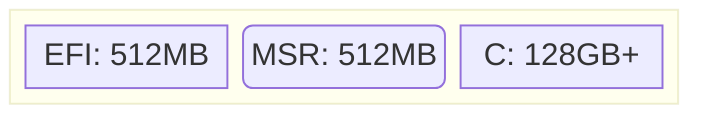
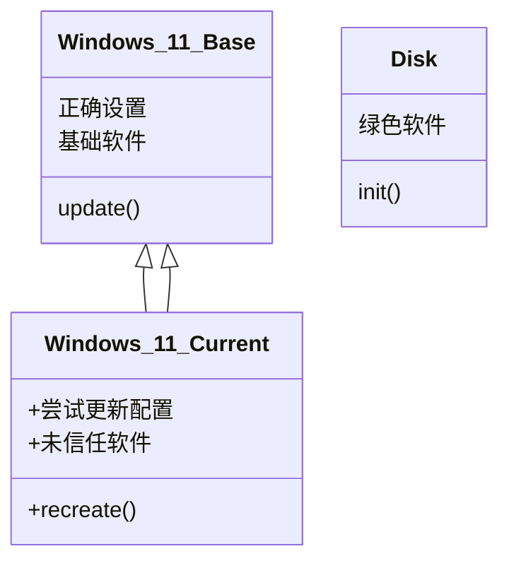

在 Windows 8 时代，微软带来了一项虚拟机技术：VHD。这是为 Hyper-V 虚拟平台设计的一种虚拟硬盘，同时支持 Windows Boot Manager 原生启动。这就为基于 VHD 的系统管理方式提供了基础。

<!--more-->

## 分区情况



## 将系统安装到 VHD

使用 **bootice** 创建一个动态 VHDX，挂载到电脑中，然后使用 **Dism++** 释放镜像到 VHDX 中，将该 VHDX 命名为 **`Windows_11_Base`**。

> [!WARNING] 关于创建 VHDX
> 使用 **磁盘管理** 创建的 VHDX 在第二次启动时必定会无法启动，原因未知。
> 使用 **bootice** 创建的则没有这个情况。

添加 `Windows_11_Base` 的引导项，进入系统进行以下操作：

- 系统更新到最新后暂停更新
- 安装必要软件
  - WinGet
  - PowerShell 7
  - 运行库等
- 关闭功能
  - VBS
  - 系统还原
  - 遥测
- 移除组件
  - Defender
  - Edge
- 设置系统

> [!WARNING] 关于系统更新
> 2025 年 4 月 8 日发布积累更新 [`KB5055523`](https://www.catalog.update.microsoft.com/Search.aspx?q=KB5055523)，向 Windows 11 全体版本——包括 LTSC 版，推送 AI 组件，鉴于 Windows 的拉跨体验，推荐不再继续往上更新，版本号停留在 `26100.3476`，即安装完 2025 年 3 月积累更新 [`KB5053598`](https://www.catalog.update.microsoft.com/Search.aspx?q=KB5053598) 为止。

## 系统优化

### 移除 Windows Defender

移除前需要关闭 Defender 的 **实时保护** 功能，建议先把 Defender 中所有安全选项都关闭，包括 SmartScreen。

使用工具 [windows-defender-remover](https://github.com/ionuttbara/windows-defender-remover) 卸载 Defender 但保持 UAC 开启。

重启后检查服务是否有包含 `Defender` 的项目。

### 关闭广告

使用工具 [OFGB](https://github.com/xM4ddy/OFGB) 都选所有选项。

### 轻松设置

使用工具 [Windows 11 轻松设置](https://www.bilibili.com/opus/904672369138729017) 进行以下设置：

- 禁用系统还原
- 禁用搜索热点
- 禁用小组件
- 禁用客户体验改善计划
- 禁用 windows 更新
- 禁用程序兼容性助手
- 删除 Edge 但保留 WebView
- 禁止 Edge 相关组件自动更新
- 禁止联网搜索
- 禁止保存搜索记录
- 禁用幽灵与熔断保护
- 禁用应用程序控制
- 禁用虚拟化安全
- 检查 Defender 是否存在

## 安装基础软件及设置系统

安装的运行库列表如下：

> [!example]- 基础软件 Winget 列表
>
> - Microsoft.VCRedist.2005.x86
> - Microsoft.VCRedist.2005.x64
> - Microsoft.VCRedist.2008.x86
> - Microsoft.VCRedist.2008.x64
> - Microsoft.VCRedist.2010.x86
> - Microsoft.VCRedist.2010.x64
> - Microsoft.VCRedist.2012.x86
> - Microsoft.VCRedist.2012.x64
> - Microsoft.VCRedist.2013.x86
> - Microsoft.VCRedist.2013.x64
> - Microsoft.VCRedist.2015+.x86
> - Microsoft.VCRedist.2015+.x64
> - Microsoft.DotNet.Runtime.3_1
> - Microsoft.DotNet.Runtime.5
> - Microsoft.DotNet.Runtime.6
> - Microsoft.DotNet.Runtime.7
> - Microsoft.DotNet.Runtime.8
> - Microsoft.DotNet.Runtime.9
> - Microsoft.DotNet.Runtime.10
> - Microsoft.DotNet.DesktopRuntime.3_1
> - Microsoft.DotNet.DesktopRuntime.5
> - Microsoft.DotNet.DesktopRuntime.6
> - Microsoft.DotNet.DesktopRuntime.7
> - Microsoft.DotNet.DesktopRuntime.8
> - Microsoft.DotNet.DesktopRuntime.9
> - Microsoft.DotNet.DesktopRuntime.10
> - Microsoft.DotNet.AspNetCore.3_1
> - Microsoft.DotNet.AspNetCore.5
> - Microsoft.DotNet.AspNetCore.6
> - Microsoft.DotNet.AspNetCore.7
> - Microsoft.DotNet.AspNetCore.8
> - Microsoft.DotNet.AspNetCore.9
> - Microsoft.DotNet.AspNetCore.10
> - Microsoft.PowerShell
> - Microsoft.XNARedist
> - Oracle.JavaRuntimeEnvironment

安装的基础软件列表如下：

> [!example]- 基础软件 Winget 列表
>
> - Gyan.FFmpeg
> - CodecGuide.K-LiteCodecPack.Full
> - Alacritty.Alacritty
> - AutoHotkey.AutoHotkey
> - voidtools.Everything
> - Git.Git
> - mcmilk.7zip-zstd
> - BluePointLilac.ContextMenuManager

### 其他绿色软件

- Clibor: 剪贴板
- FlowLauncher: 启动器
- Notepad4: 替换系统笔记本
- PixPin: 截图
- DirectoryOpus: 替换资源管理器
- Foobar2000: 作为默认音频播放器
- GoogleChrome: 作为默认浏览器
- GridMove: 快捷窗口管理
- Mpv: 作为默认视频播放器
- XnViewMP: 作为默认图片查看器

## 清理系统

完成基础设置后进行清理，可使用 **FluentCleaner** 和 **Dism++** 进行清理。

后续 `Windows_11_Base` 将作为母版，非特殊情况不再改动此镜像。

## 创建差分 VHDX

新建一个 VHDX 链接到 `Windows_11_Base`，命名为 **`Windows_11_Current`** 添加到启动项作为日常使用。

需要登陆使用或更新频繁的软件则在生成 `Windows_11_Current` 后安装。由于猫猫使用的便携软件较多，大多数软件可以在生成 `Windows_11_Current` 后复制快捷方式到开始菜单即可。

依赖关系：



PE 环境中重新创建 `Windows_11_Current` 链接：

```bat
@echo off
cd /d %~dp0

echo Create new 'Windows_11_Current.vhdx'?
pause
del ".\Windows_11_Current.vhdx"
start /wait diskpart /s .\Data\CreateSubVhd

echo "Finish!"
pause
```

所需的 Diskpart 脚本文件 `.\Data\CreateSubVHD` 如下，其中 `C:\SYSTEM\` 为 VHDX 所在文件夹的绝对路径：

```bat
select vdisk file="C:\SYSTEM\Windows_11_Base.vhdx"
attach vdisk readonly
compact vdisk
detach vdisk
create vdisk file="C:\SYSTEM\Windows_11_Current.vhdx" parent="C:\SYSTEM\Windows_11_Base.vhdx"
```

今后每几个月进入 `BAWindows_11_BaseSE` 升级系统和基础软件，重新生成 `Windows_11_Current` 链接，就相当于重装系统了。
