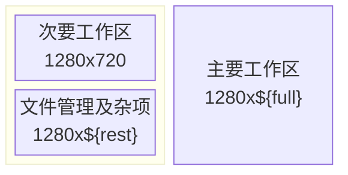

GridMove 是一个使用 AutoHotKey_v1 的窗口管理工具，可快速地将窗口放置在指定的位置并调整大小。

官方网站：[:(fa-brands fa-github): Github:mirtlecn/GridMove](https://github.com/mirtlecn/GridMove)

<!--more-->

## 方案

猫猫使用的屏幕是 2.5k 屏，分辨率为 `2560x1440`。
为最大限度利用空间，猫猫将屏幕拆分成了 3 各部分：

- 左上角放置足够 1280x720 的空间用于临时观影、编辑作为不太占空间的工作区；
- 左下方剩余空间 用于放置文件管理器、临时编辑或其他杂七杂八的浮动小窗口；
- 右侧留给主要工作区，宽度保证 1280，如浏览器、VScode等，需要两个大型工作区时，可将浏览器放置在此区域，另一窗口使用贴靠停放在左侧。



## 配置


可在程序配置文件 `GridMove.exe.ini` 中使用 `Gap = -1` 来解决 Windows 10/11 中窗口边框的问题，让活动窗口边框叠加在非活动窗口之上（忽略 1 像素窗口边框）。

以下时示例配置：

```ini
[GridSettings]
GridName  = Grids/3_i1280_720.grid
GridOrder = 3 Part
Gap       = -1

[InterfaceSettings]
MButtonDrag    = 1
AltDragMove    = 0
WinDragMove    = 0
EdgeDrag       = 0
MButtonTimeout = 0.3
Transparency   = 200
NoTrayIcon     = 0
AltDragToggle  = 0

[OtherSettings]
EdgeTime                     = 500
ShowGroupsFlag               = 0
ShowNumbersFlag              = 1
DisableTitleButtonsDetection = 0
ColorTheme                   = orange
Language                     = zh_CN

[ProgramSettings]
UseCommand        = 0
CommandHotkey     = !g
UseFastMove       = 1
FastMoveModifiers = !
FastMoveMeta      = 
SafeMode          = 1
TitleLeft         = 25
Exceptions        = 
SequentialMove    = 0
DebugMode         = 0

[IniSettings]
iniversion = 15
FirstRun   = 0
```

参考 [Windows 窗口边框设置](/posts/windows-window-border)，可以得到 一个窗口内容为 `1280x720` 的窗口大小为 `1280x746`。

使用 `TriggerTop` 和 `TriggerLeft` 可定位窗口，`TriggerBottom` 和 `TriggerRight` 可指定窗口大小。

> [!NOTE] 笔记
> 分隔配置文件中的 `Monitor` 不包括开始菜单占用区域。

```ini {title="3_i1280_720"}
[Groups]
NumberOfGroups = 3

[1]
TriggerTop    = [Monitor1Top]
TriggerLeft   = [Monitor1Left]
TriggerBottom = [Monitor1Top] + 746
TriggerRight  = [Monitor1Left] + 1280

[2] 
TriggerTop    = [Monitor1Top] + 746
TriggerLeft   = [Monitor1Left]
TriggerBottom = [Monitor1Bottom]
TriggerRight  = [Monitor1Left] + 1280

[3] 
TriggerTop    = [Monitor1Top]
TriggerLeft   = [Monitor1Left] + 1280
TriggerBottom = [Monitor1Bottom]
TriggerRight  = [Monitor1Right]
```

为避免每次开机弹 UAC 窗口，可参考这篇文章：[使用 Windows 计划任务配置管理员启动项](/posts/windows-scheduler-admin-enable)。
