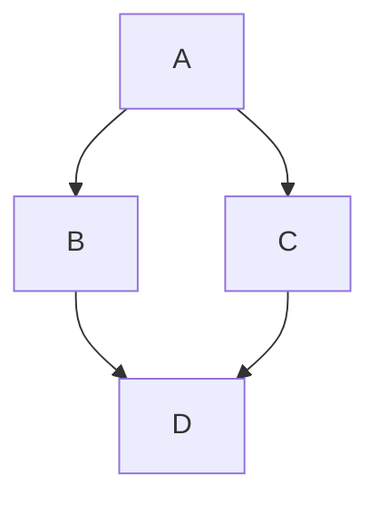

# 组件库

Docusaurus 支持 MDX 文档，这极大提升了编写 Markdown 的自由。

本页面将展示常用的模块，也可查看 **[官方文档](https://docusaurus.io/docs/markdown-features)**。

## Markdown 基础组件

### 字体样式

- **粗体**
- _斜体_
- **_粗斜体_**

### 链接

- [页面链接](http://github.com/)
- [路由链接](/blog/)
- [页面链接](writing/create-blog.md)
- [锚点链接](#markdown-基础组件)

### 图片


### 代码

```ts title="index.ts" {2} showLineNumbers
console.log("Hello");
console.log("代码可以高亮");
```

### Mermaid



### 引用

> 这是一篇引用
>
> > 这是引用中的引用
>
> -- 作者

### 提示块

:::note[笔记]
可以使用 [此 `api`](#)。
:::

:::tip[成功]
使用 [此 `api`](#) 成功。
:::

:::info[信息]
已使用 [此 `api`](#)。
:::

:::warning[警告]
[此 `api`](#) 已过时。
:::

:::danger[错误]
调用 [此 `api`](#) 发生错误。
:::

## Html 组件

### 折叠框

<details>
  <summary>折叠框</summary>

这些是被折叠的内容。

```ts
console.log("可以嵌套使用 Markdown 语法");
```

  <details>
    <summary>内部折叠框</summary>

喵~

  </details>
</details>

### 按键

记得 <kbd>Ctrl</kbd> + <kbd>S</kbd> 保存

## Jsx 组件

以 `export`、`import` 开头的段落才会被解析为 Jsx 代码，而不是散文。

`@site` 别名将指向开发目录（通常是 `docusaurus.config.js` 文件所在的位置）。

### SVG 图标

import ArchIcon from "@site/src/icons/ArchLinux.svg";

<ArchIcon />

### 标签

import Tabs from "@theme/Tabs";
import TabItem from "@theme/TabItem";

<Tabs groupId="fruits">
  <TabItem value="apple" label="苹果" default>
    🍎
  </TabItem>
  <TabItem value="orange" label="橘子">
    🍊
  </TabItem>
  <TabItem value="banana" label="香蕉">
    🍌
  </TabItem>
</Tabs>
